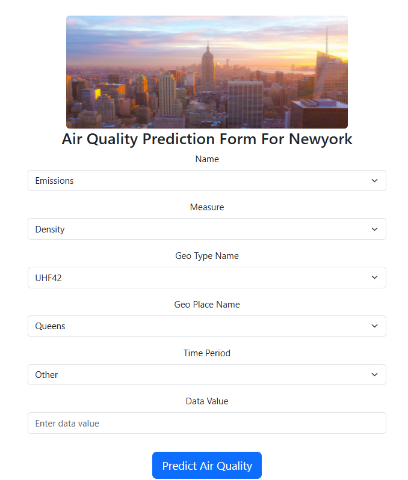
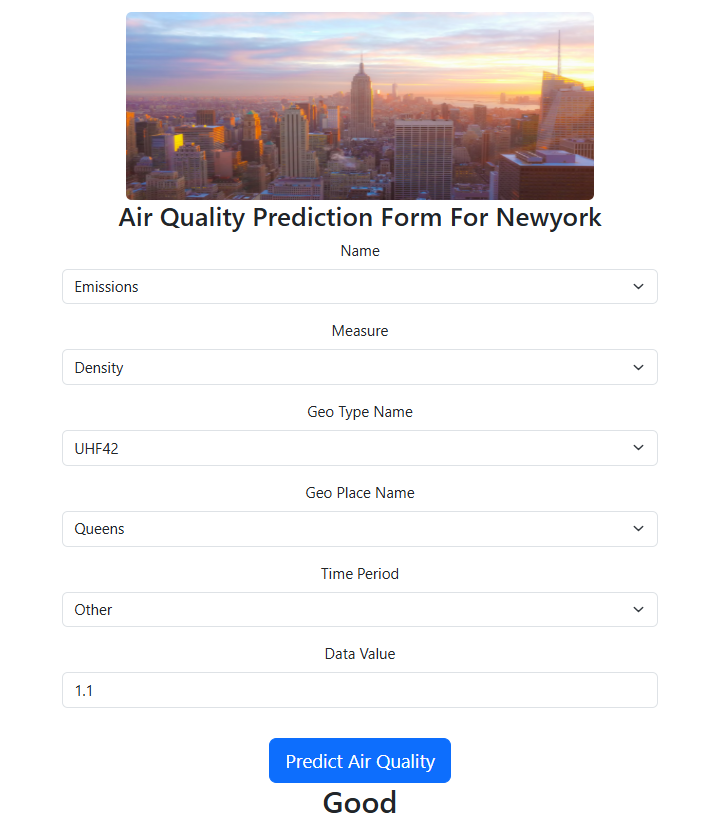

# New York Weather & Air Quality Prediction Website

This project is a web application that provides weather and air quality predictions for New York City using machine learning techniques. The backend leverages an XGBoost model to classify air quality categories based on provided data.

## Features

- **Weather & Air Quality Data**: Predicts air quality categories such as 'Good,' 'Moderate,' or 'Bad.'
- **Machine Learning Model**: XGBoost classifier trained on labeled air quality datasets.
- **Interactive Visualizations**: Track and analyze trends in air quality.
- **Code for Preprocessing and Training**: Includes all steps for preprocessing and training the model.

## Tech Stack

- **Backend**: Python, XGBoost, Scikit-learn, Flask
- **Frontend**: HTML, CSS (with Flask templates)
- **Data Preprocessing**: Pandas, Numpy
- **Model Training & Evaluation**: XGBoost, Cross-validation
- **Serialization**: Pickle

## Dataset
Data set taken from this link : [New York Weather & Air Quality Dataset](https://www.kaggle.com/datasets/fatmanur12/new-york-air-quality)

Install dependencies:
   ```bash
   pip install -r requirements.txt
   ```

## Screenshots


